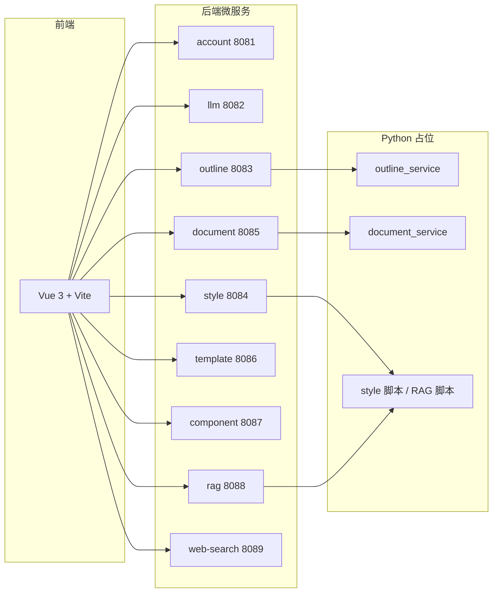

# 全栈智能 PPT 生成系统 — 项目架构骨架

---

## 技术栈（规划）

| 层级 | 技术 |
|------|------|
| 前端 | Vue 3、Vue Router、Pinia、Vite、TypeScript、Axios |
| 后端 | Java 17、Spring Boot 3.2、`common` 统一响应体 |
| AI / 检索 | `llm-service`；`rag-service` + Python 脚本；`web-search-service` 外部检索 |
| 脚本 | Python 3（大纲、文档解析、风格提取、RAG 等，按模块分目录） |

---

## Maven 模块与职责

| 模块 | 默认端口 | 说明 |
|------|----------|------|
| `common` | — | 公共类型（如统一 `Result`） |
| `account-service` | 8081 | 账号与鉴权（骨架阶段未接数据库） |
| `llm-service` | 8082 | 大模型调用网关 |
| `outline-service` | 8083 | 大纲：Java REST + `outline_service/` Python 占位 |
| `style-service` | 8084 | 风格与配图；根目录 Python 脚本占位 |
| `document-service` | 8085 | PDF/图片；`document_service/` Python 占位 |
| `template-service` | 8086 | 版式库（`context-path: /api`） |
| `component-service` | 8087 | 组件库（`context-path: /api`） |
| `rag-service` | 8088 | 知识库向量检索（`context-path: /api`） |
| `web-search-service` | 8089 | 联网检索（`context-path: /api`） |

前端独立目录：`frontend/`（Vite 默认 **5173**）。

---

## 架构示意



---

## 本地验证（骨架可启动）

**后端（示例启动一个模块）：**

```bash
cd project-copy
mvn -q -pl account-service spring-boot:run
```

**前端：**

```bash
cd frontend
npm install
npm run dev
```

各服务可并行启动；详细代理规则见 `frontend/vite.config.ts`（与完整项目对齐的端口约定）。

---

## 与完整工程的关系

业务实现、数据库、提示词与具体 API 在仓库主目录中开发；本目录仅保留**结构搭建**供按周提交。后续周次可在主工程继续实现，再视课程要求更新说明文档。
